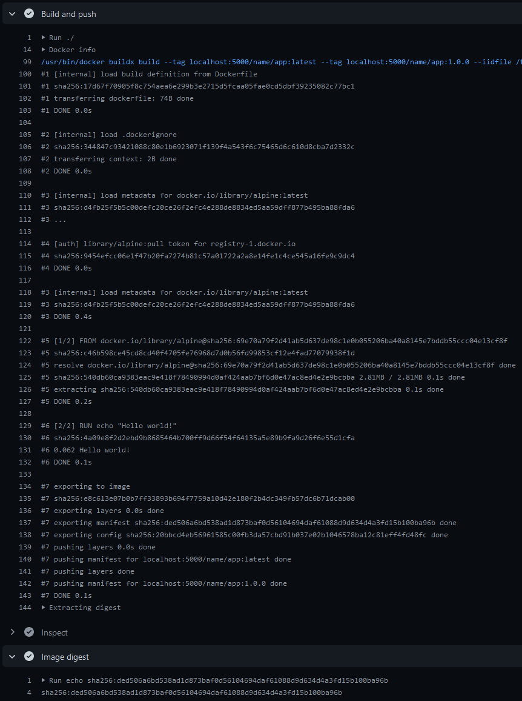
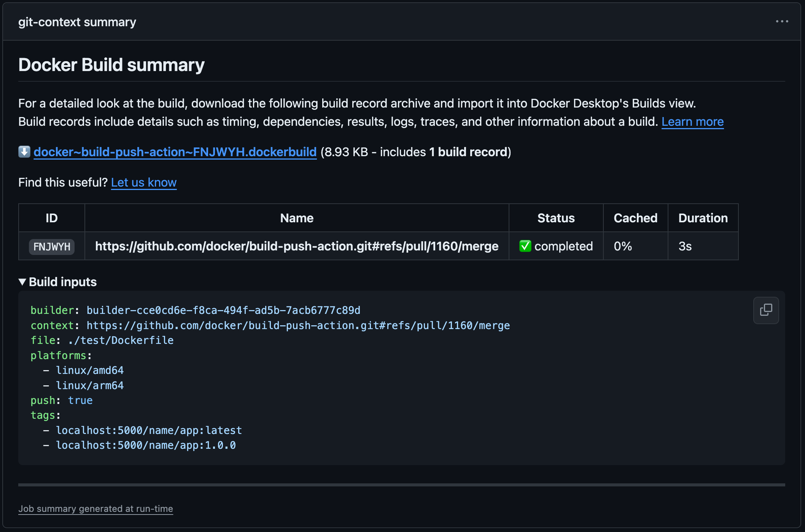

[](https://github.com/docker/build-push-action/releases/latest)
[](https://github.com/marketplace/actions/build-and-push-docker-images)
[](https://github.com/docker/build-push-action/actions?workflow=ci)
[](https://github.com/docker/build-push-action/actions?workflow=test)
[](https://codecov.io/gh/docker/build-push-action)

## About

GitHub Action to build and push Docker images with [Buildx](https://github.com/docker/buildx)
with full support of the features provided by [Moby BuildKit](https://github.com/moby/buildkit)
builder toolkit. This includes multi-platform build, secrets, remote cache, etc.
and different builder deployment/namespacing options.



___

* [Usage](#usage)
  * [Git context](#git-context)
  * [Path context](#path-context)
* [Examples](#examples)
* [Summaries](#summaries)
* [Customizing](#customizing)
  * [inputs](#inputs)
  * [outputs](#outputs)
  * [environment variables](#environment-variables)
* [Troubleshooting](#troubleshooting)
* [Contributing](#contributing)

## Usage

In the examples below we are also using 3 other actions:

* [`setup-buildx`](https://github.com/docker/setup-buildx-action) action will
  create and boot a builder using by default the [`docker-container` driver](https://docs.docker.com/build/building/drivers/docker-container/).
  This is **not required but recommended** using it to be able to build
  multi-platform images, export cache, etc.
* [`setup-qemu`](https://github.com/docker/setup-qemu-action) action can be
  useful if you want to add emulation support with QEMU to be able to build
  against more platforms. 
* [`login`](https://github.com/docker/login-action) action will take care to
  log in against a Docker registry.

### Git context

By default, this action uses the [Git context](https://docs.docker.com/engine/reference/commandline/build/#git-repositories),
so you don't need to use the [`actions/checkout`](https://github.com/actions/checkout/)
action to check out the repository as this will be done directly by [BuildKit](https://github.com/moby/buildkit).

The git reference will be based on the [event that triggered your workflow](https://docs.github.com/en/actions/using-workflows/events-that-trigger-workflows)
and will result in the following context: `https://github.com/<owner>/<repo>.git#<ref>`.

```yaml
name: ci

on:
  push:

jobs:
  docker:
    runs-on: ubuntu-latest
    steps:
      -
        name: Set up QEMU
        uses: docker/setup-qemu-action@v3
      -
        name: Set up Docker Buildx
        uses: docker/setup-buildx-action@v3
      -
        name: Login to Docker Hub
        uses: docker/login-action@v3
        with:
          username: ${{ secrets.DOCKERHUB_USERNAME }}
          password: ${{ secrets.DOCKERHUB_TOKEN }}
      -
        name: Build and push
        uses: docker/build-push-action@v6
        with:
          push: true
          tags: user/app:latest
```

Be careful because **any file mutation in the steps that precede the build step
will be ignored, including processing of the `.dockerignore` file** since
the context is based on the Git reference. However, you can use the
[Path context](#path-context) using the [`context` input](#inputs) alongside
the [`actions/checkout`](https://github.com/actions/checkout/) action to remove
this restriction.

Default Git context can also be provided using the [Handlebars template](https://handlebarsjs.com/guide/)
expression `{{defaultContext}}`. Here we can use it to provide a subdirectory
to the default Git context:

```yaml
      -
        name: Build and push
        uses: docker/build-push-action@v6
        with:
          context: "{{defaultContext}}:mysubdir"
          push: true
          tags: user/app:latest
```

Building from the current repository automatically uses the [GitHub Token](https://docs.github.com/en/actions/security-guides/automatic-token-authentication),
so it does not need to be passed. If you want to authenticate against another
private repository, you have to use a [secret](https://docs.docker.com/build/ci/github-actions/secrets)
named `GIT_AUTH_TOKEN` to be able to authenticate against it with Buildx:

```yaml
      -
        name: Build and push
        uses: docker/build-push-action@v6
        with:
          push: true
          tags: user/app:latest
          secrets: |
            GIT_AUTH_TOKEN=${{ secrets.MYTOKEN }}
```

### Path context

```yaml
name: ci

on:
  push:

jobs:
  docker:
    runs-on: ubuntu-latest
    steps:
      -
        name: Checkout
        uses: actions/checkout@v4
      -
        name: Set up QEMU
        uses: docker/setup-qemu-action@v3
      -
        name: Set up Docker Buildx
        uses: docker/setup-buildx-action@v3
      -
        name: Login to Docker Hub
        uses: docker/login-action@v3
        with:
          username: ${{ secrets.DOCKERHUB_USERNAME }}
          password: ${{ secrets.DOCKERHUB_TOKEN }}
      -
        name: Build and push
        uses: docker/build-push-action@v6
        with:
          context: .
          push: true
          tags: user/app:latest
```

## Examples

* [Multi-platform image](https://docs.docker.com/build/ci/github-actions/multi-platform/)
* [Secrets](https://docs.docker.com/build/ci/github-actions/secrets/)
* [Push to multi-registries](https://docs.docker.com/build/ci/github-actions/push-multi-registries/)
* [Manage tags and labels](https://docs.docker.com/build/ci/github-actions/manage-tags-labels/)
* [Cache management](https://docs.docker.com/build/ci/github-actions/cache/)
* [Export to Docker](https://docs.docker.com/build/ci/github-actions/export-docker/)
* [Test before push](https://docs.docker.com/build/ci/github-actions/test-before-push/)
* [Local registry](https://docs.docker.com/build/ci/github-actions/local-registry/)
* [Share built image between jobs](https://docs.docker.com/build/ci/github-actions/share-image-jobs/)
* [Named contexts](https://docs.docker.com/build/ci/github-actions/named-contexts/)
* [Copy image between registries](https://docs.docker.com/build/ci/github-actions/copy-image-registries/)
* [Update Docker Hub repo description](https://docs.docker.com/build/ci/github-actions/update-dockerhub-desc/)
* [SBOM and provenance attestations](https://docs.docker.com/build/ci/github-actions/attestations/)
* [Annotations](https://docs.docker.com/build/ci/github-actions/annotations/)
* [Reproducible builds](https://docs.docker.com/build/ci/github-actions/reproducible-builds/)

## Summaries

This action generates a [job summary](https://github.blog/2022-05-09-supercharging-github-actions-with-job-summaries/)
that provides a detailed overview of the build execution. The summary shows an
overview of all the steps executed during the build, including the build inputs
and eventual errors.



The summary also includes a link for downloading the build record with
additional details about the build, including build stats, logs, outputs, and
more. The build record can be imported to Docker Desktop for inspecting the
build in greater detail.

Summaries are enabled by default, but can be disabled with the
`DOCKER_BUILD_SUMMARY` [environment variable](#environment-variables).

For more information about summaries, refer to the
[documentation](https://docs.docker.com/go/build-summary/).

## Customizing

### inputs

The following inputs can be used as `step.with` keys:

> `List` type is a newline-delimited string
> ```yaml
> cache-from: |
>   user/app:cache
>   type=local,src=path/to/dir
> ```

> `CSV` type is a comma-delimited string
> ```yaml
> tags: name/app:latest,name/app:1.0.0
> ```

| Name               | Type        | Description                                                                                                                                                                       |
|--------------------|-------------|-----------------------------------------------------------------------------------------------------------------------------------------------------------------------------------|
| `add-hosts`        | List/CSV    | List of [customs host-to-IP mapping](https://docs.docker.com/engine/reference/commandline/build/#add-entries-to-container-hosts-file---add-host) (e.g., `docker:10.180.0.1`)      |
| `allow`            | List/CSV    | List of [extra privileged entitlement](https://docs.docker.com/engine/reference/commandline/buildx_build/#allow) (e.g., `network.host,security.insecure`)                         |
| `annotations`      | List        | List of annotation to set to the image                                                                                                                                            |
| `attests`          | List        | List of [attestation](https://docs.docker.com/build/attestations/) parameters (e.g., `type=sbom,generator=image`)                                                                 | 
| `builder`          | String      | Builder instance (see [setup-buildx](https://github.com/docker/setup-buildx-action) action)                                                                                       |
| `build-args`       | List        | List of [build-time variables](https://docs.docker.com/engine/reference/commandline/buildx_build/#build-arg)                                                                      |
| `build-contexts`   | List        | List of additional [build contexts](https://docs.docker.com/engine/reference/commandline/buildx_build/#build-context) (e.g., `name=path`)                                         |
| `cache-from`       | List        | List of [external cache sources](https://docs.docker.com/engine/reference/commandline/buildx_build/#cache-from) (e.g., `type=local,src=path/to/dir`)                              |
| `cache-to`         | List        | List of [cache export destinations](https://docs.docker.com/engine/reference/commandline/buildx_build/#cache-to) (e.g., `type=local,dest=path/to/dir`)                            |
| `cgroup-parent`    | String      | Optional [parent cgroup](https://docs.docker.com/engine/reference/commandline/build/#use-a-custom-parent-cgroup---cgroup-parent) for the container used in the build              |
| `context`          | String      | Build's context is the set of files located in the specified [`PATH` or `URL`](https://docs.docker.com/engine/reference/commandline/build/) (default [Git context](#git-context)) |
| `file`             | String      | Path to the Dockerfile. (default `{context}/Dockerfile`)                                                                                                                          |
| `labels`           | List        | List of metadata for an image                                                                                                                                                     |
| `load`             | Bool        | [Load](https://docs.docker.com/engine/reference/commandline/buildx_build/#load) is a shorthand for `--output=type=docker` (default `false`)                                       |
| `network`          | String      | Set the networking mode for the `RUN` instructions during build                                                                                                                   |
| `no-cache`         | Bool        | Do not use cache when building the image (default `false`)                                                                                                                        |
| `no-cache-filters` | List/CSV    | Do not cache specified stages                                                                                                                                                     |
| `outputs`          | List        | List of [output destinations](https://docs.docker.com/engine/reference/commandline/buildx_build/#output) (format: `type=local,dest=path`)                                         |
| `platforms`        | List/CSV    | List of [target platforms](https://docs.docker.com/engine/reference/commandline/buildx_build/#platform) for build                                                                 |
| `provenance`       | Bool/String | Generate [provenance](https://docs.docker.com/build/attestations/slsa-provenance/) attestation for the build (shorthand for `--attest=type=provenance`)                           |
| `pull`             | Bool        | Always attempt to pull all referenced images (default `false`)                                                                                                                    |
| `push`             | Bool        | [Push](https://docs.docker.com/engine/reference/commandline/buildx_build/#push) is a shorthand for `--output=type=registry` (default `false`)                                     |
| `sbom`             | Bool/String | Generate [SBOM](https://docs.docker.com/build/attestations/sbom/) attestation for the build (shorthand for `--attest=type=sbom`)                                                  |
| `secrets`          | List        | List of [secrets](https://docs.docker.com/engine/reference/commandline/buildx_build/#secret) to expose to the build (e.g., `key=string`, `GIT_AUTH_TOKEN=mytoken`)                |
| `secret-envs`      | List/CSV    | List of [secret env vars](https://docs.docker.com/engine/reference/commandline/buildx_build/#secret) to expose to the build (e.g., `key=envname`, `MY_SECRET=MY_ENV_VAR`)         |
| `secret-files`     | List        | List of [secret files](https://docs.docker.com/engine/reference/commandline/buildx_build/#secret) to expose to the build (e.g., `key=filename`, `MY_SECRET=./secret.txt`)         |
| `shm-size`         | String      | Size of [`/dev/shm`](https://docs.docker.com/engine/reference/commandline/buildx_build/#shm-size) (e.g., `2g`)                                                                    |
| `ssh`              | List        | List of [SSH agent socket or keys](https://docs.docker.com/engine/reference/commandline/buildx_build/#ssh) to expose to the build                                                 |
| `tags`             | List/CSV    | List of tags                                                                                                                                                                      |
| `target`           | String      | Sets the target stage to build                                                                                                                                                    |
| `ulimit`           | List        | [Ulimit](https://docs.docker.com/engine/reference/commandline/buildx_build/#ulimit) options (e.g., `nofile=1024:1024`)                                                            |
| `github-token`     | String      | GitHub Token used to authenticate against a repository for [Git context](#git-context) (default `${{ github.token }}`)                                                            |

### outputs

The following outputs are available:

| Name       | Type    | Description           |
|------------|---------|-----------------------|
| `imageid`  | String  | Image ID              |
| `digest`   | String  | Image digest          |
| `metadata` | JSON    | Build result metadata |

### environment variables

| Name                                 | Type   | Default | Description                                                                                                                                                                                                                                                        |
|--------------------------------------|--------|---------|--------------------------------------------------------------------------------------------------------------------------------------------------------------------------------------------------------------------------------------------------------------------|
| `DOCKER_BUILD_SUMMARY`               | Bool   | `true`  | If `false`, [build summary](https://docs.docker.com/build/ci/github-actions/build-summary/) generation is disabled                                                                                                                                                 |
| `DOCKER_BUILD_RECORD_UPLOAD`         | Bool   | `true`  | If `false`, build record upload as [GitHub artifact](https://docs.github.com/en/actions/using-workflows/storing-workflow-data-as-artifacts) is disabled                                                                                                            |
| `DOCKER_BUILD_RECORD_RETENTION_DAYS` | Number |         | Duration after which build record artifact will expire in days. Defaults to repository/org [retention settings](https://docs.github.com/en/actions/learn-github-actions/usage-limits-billing-and-administration#artifact-and-log-retention-policy) if unset or `0` |

## Troubleshooting

See [TROUBLESHOOTING.md](TROUBLESHOOTING.md)

## Contributing

Want to contribute? Awesome! You can find information about contributing to
this project in the [CONTRIBUTING.md](/.github/CONTRIBUTING.md)
